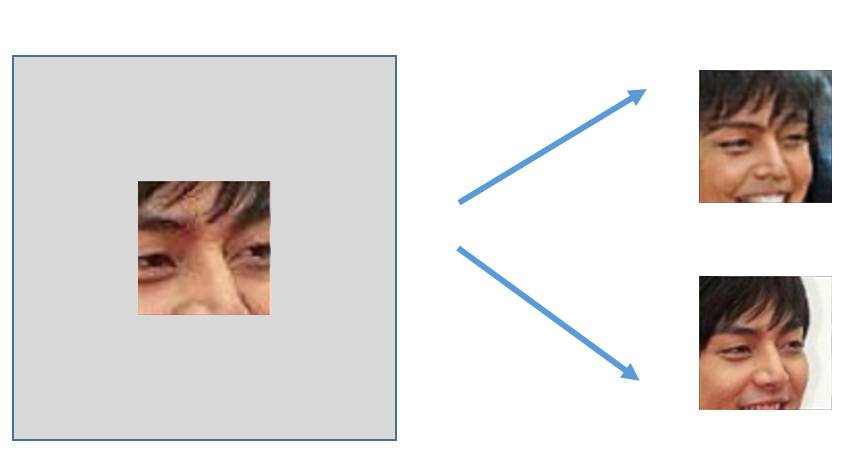

# Image Models

Suppose we are able to learn a probability distribution $$p(x)$$ over images (a matrix of pixels) that assigns high probability to images that look realistic, and low probability to everything else. Given this model, there are a number of tasks that can be solved:  

## Sampling

Suppose we are somehow able to learn a probability distribution that assigns high probability to images that look like bedrooms (based on some training data):

**Training Data**  
  

If we sample $$x \sim p(x)$$, we are **generating** new (realistic) images: 

**Generated Data**  

If we train the model on human faces, we can generate new ones:

[Progressive Growing of GANs for Improved Quality, Stability, and Variation](https://arxiv.org/abs/1710.10196)

Other examples:

## In Painting

Suppose we have our probability distribution $$p(x)$$, and a patch of an existing image (e.g., a piece of a photograph).  If we sample from $$p(Image \mid patch)$$, we will generate different possible ways of completing the image:

Note the importance of a probabilistic model that captures uncertainty: there could be multiple ways to complete the image!

## Image Denoising

Given an image corrupted by noise (e.g., an old photograph), we can attempt to restore it based on our probabilistic model of what images look like

# Text Models

Suppose we can construct a probability distribution $$p(x)$$ over sequences of words or characters $$x$$ that assigns high probability to (English) sentences.

## Sampling

Suppose we use Wikipedia as our training data, and learn a model $$p(x)$$ based on it. We can then sample from the model, generating new Wikipedia-like articles like the following one:

---
Naturalism and decision for the majority of Arab countries' capitalide was grounded
by the Irish language by [[John Clair]], [[An Imperial Japanese Revolt]], associated 
with Guangzham's sovereignty. His generals were the powerful ruler of the Portugal 
in the [[Protestant Immineners]], which could be said to be directly in Cantonese 
Communication, which followed a ceremony and set inspired prison, training. The 
emperor travelled back to [[Antioch, Perth, October 25|21]] to note, the Kingdom 
of Costa Rica, unsuccessful fashioned the [[Thrales]], [[Cynth's Dajoard]], known 
in western [[Scotland]], near Italy to the conquest of India with the conflict. 
Copyright was the succession of independence in the slop of Syrian influence that 
was a famous German movement based on a more popular servicious, non-doctrinal 
and sexual power post. Many governments recognize the military housing of the 
[[Civil Liberalization and Infantry Resolution 265 National Party in Hungary]], 
that is sympathetic to be to the [[Punjab Resolution]]
(PJS)[http://www.humah.yahoo.com/guardian.
cfm/7754800786d17551963s89.htm Official economics Adjoint for the Nazism, Montgomery 
was swear to advance to the resources for those Socialism's rule, 
was starting to signing a major tripad of aid exile.]]

---

[The Unreasonable Effectiveness of Recurrent Neural Networks](http://karpathy.github.io/2015/05/21/rnn-effectiveness/)

## Translation

Suppose we have learned probabilistic models for both English and Chinese. We can use the model to generate an English sentence conditioned on the corresponding Chinese one (translation): 

# Audio Models

Suppose we can construct a probability distribution $$p(x)$$ over audio signals that assigns high probability to ones that sounds like human speech.

## Upsampling or super-resolution

Given a low resolution version of an audio signal, we can attempt to increase its resolution

[Super resolution of audio signals demo](https://kuleshov.github.io/audio-super-res/)

## Speech synthesis

As before, by sampling from the model we can generate (synthesize) speech signals.

[Super resolution of audio signals demo](https://deepmind.com/blog/wavenet-generative-model-raw-audio/)

## Speech recognition
Given a (joint) model of speech signals and language (text), we can attempt to infer spoken words from audio signals

# Error Correcting Codes
Probabilistic models are often used to model communication channels (e.g., Ethernet or Wifi), i.e., the fact that if you send a message over a channel, you might get something different on the other end due to noise. Error correcting codes and techniques based on graphical models are used to detect and correct communication errors.

# Computational Biology

Graphical models are often used in computational biology. For example, given a model of how DNA sequences evolve over time, it is possible to reconstruct a phylogenetic tree from DNA sequences of current species

# Spatio-temporal models

## Ecology
Graphical models are used to study phenomena that evolve over space and time, capturing spatial and temporal dependencies. For example, they can be used to study bird migrations

## Economics

Graphical models can be used to model spatial distributions of quantities of interests (e.g., assets or expenditures based measures of wealth)

 

|[Index](../../) | [Previous](../probabilityreview/) |  [Next](../../representation/directed/)|
